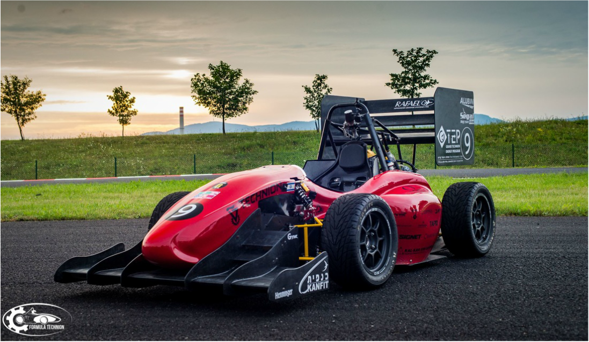

# Cone_detection
Chenhao Yang

## Summary
This repository contains an end-to-end deep learning method for traffic cone detection.

## Abstract
The development of detecting and position estimating of objects has became more and more prevailing in the field of robotics and autonomous driving. In this report, we developed a cone detection algorithm for the autonomous formula student using deep learning approaches. We created 3D point cloud data to simulate LiDAR scannings for supervised training. Our detection approach is to voxelize the point cloud and create pseudo images first, and then using 2D convolution layers and variational autoencoder model for feature extraction and generation of cone coordinate candidates. Finally, we used non-maximum suppression to get outputs and fine results.

## License
>The MIT License (MIT)
>Copyright (c) 2021 Chenhao Yang
>Permission is hereby granted, free of charge, to any person obtaining a copy of this software and associated documentation files (the "Software"), to deal in the Software without restriction, including without limitation the rights to use, copy, modify, merge, publish, distribute, sublicense, and/or sell copies of the Software, and to permit persons to whom the Software is furnished to do so, subject to the following conditions:
>The above copyright notice and this permission notice shall be included in all copies or substantial portions of the Software.
>THE SOFTWARE IS PROVIDED "AS IS", WITHOUT WARRANTY OF ANY KIND, EXPRESS OR IMPLIED, INCLUDING BUT NOT LIMITED TO THE WARRANTIES OF MERCHANTABILITY, FITNESS FOR A PARTICULAR PURPOSE AND NONINFRINGEMENT. IN NO EVENT SHALL THE AUTHORS OR COPYRIGHT HOLDERS BE LIABLE FOR ANY CLAIM, DAMAGES OR OTHER LIABILITY, WHETHER IN AN ACTION OF CONTRACT, TORT OR OTHERWISE, ARISING FROM, OUT OF OR IN CONNECTION WITH THE SOFTWARE OR THE USE OR OTHER DEALINGS IN THE SOFTWARE.
